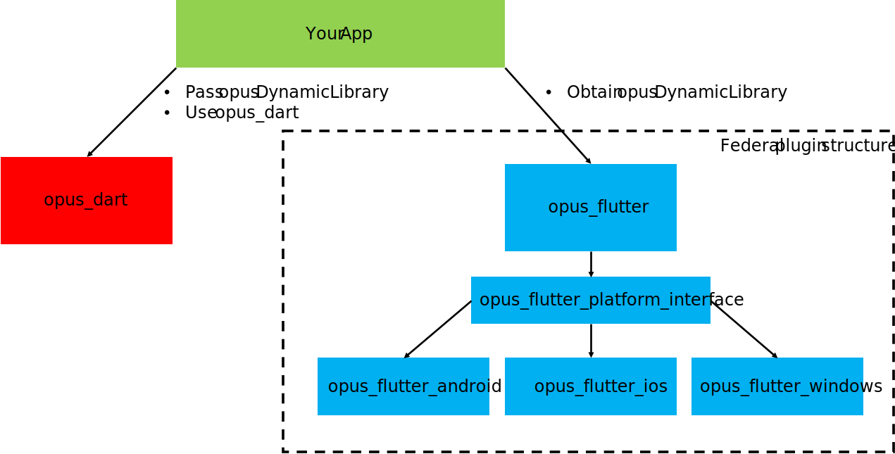

# opus_flutter
With the upcoming of the federal plugin system, this package was reorganized.
Instead of providing access to the opus functions, it is now just a loader package to obtain a `DynamicLibrary` for [opus_dart](https://pub.dev/packages/opus_dart) on flutter-based projects.
The overall scheme is now the following:
\
\
\

## Versioning
Currently, opus 1.5.2 is loaded.

## Why are opus_dart and opus_flutter still two packages?
The answer on that is simlple: dart is more than just flutter. With this split approach, it is easy to obtain a `DynamicLibrary` on flutter-based projects, but it is still possible to use opus_dart without flutter (e.g. on headless servers where there is no need for flutter). An other adventage for flutter developers with this split is, that they have a convenient way to obtain opus as `DynamicLibrary`, but are not forced to use it with opus_dart.

## How this package contains opus
To see, how (sources or binaries) the platform packages contain opus, checkout their respective pages on pub or github. Some include sources and build automatically while others include prebuild binaries. While the final goal is to provide sources and automatic builds on all platforms, some platforms don't provide a mature building system yet.